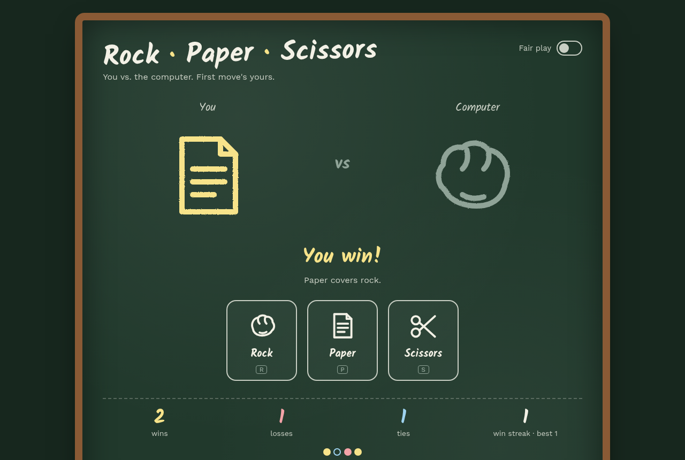

# Rock Paper Scissors (C#)

A console rock-paper-scissors game I wrote to learn C# and .NET: you type a move, the computer picks one at random, and it keeps score. The rules live in a small `Rules` class with built-in self-tests, so the game loop stays simple.

I also made a **browser version** drawn on a chalkboard. It has a "rock… paper… scissors… shoot!" countdown and a *smart mode* where the computer starts reading your habits.

**Play in your browser:** https://dave-4u.github.io/csharp-rock-paper-scissors/



## Quickstart

Needs the [.NET 8 SDK](https://dotnet.microsoft.com/download).

```bash
./run.sh          # play (same as: dotnet run)
./run.sh test     # run the self-tests (same as: dotnet run -- --selftest)
```

```
Your move: r
Computer chose: scissors
You win!
Score — Wins: 1  Losses: 0  Ties: 0
```

## Features

- **Console:** accepts full words or just `r` / `p` / `s`, tracks wins, losses, ties, and your best win streak
- **Browser (`docs/index.html`):** chalk-style hand drawings, a countdown animation, win/lose explanations ("Paper covers rock."), streaks, round history dots, score saved in your browser, keyboard play (`R` `P` `S`), and an optional smart mode
- Self-tests for every rule (`--selftest`)

## Tech stack

C# 12 / .NET 8 console app. The web version is a single HTML file with vanilla JS and SVG.

## Roadmap

- Best-of-five match mode
- Rock-paper-scissors-lizard-Spock variant

## License

MIT © Adegboro David Oluwadamilare
